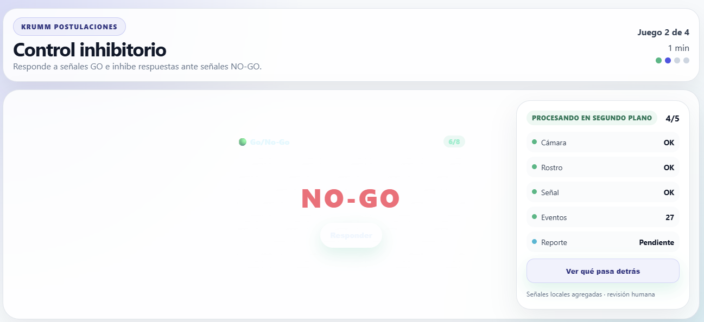
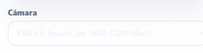
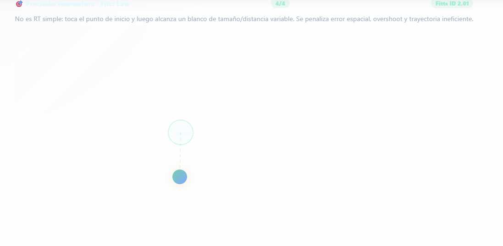
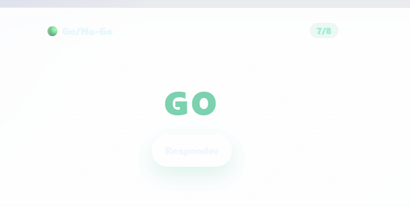
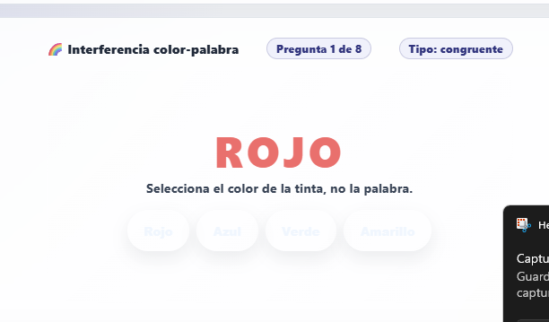
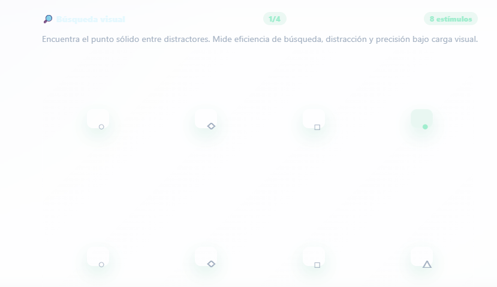
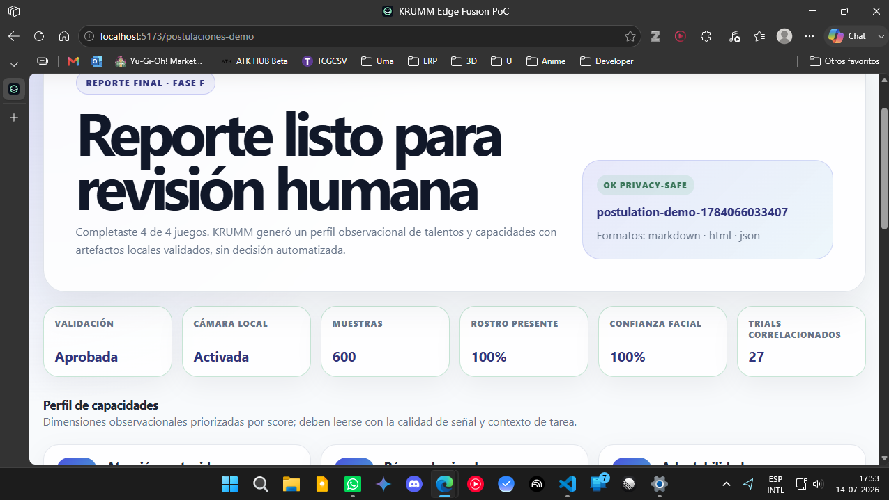

# KRUMM Postulation Demo — QA editable Fase J/I

> **ARCHIVO HISTÓRICO.** Conserva evidencias de las fases DG/R-5 y no debe usarse como checklist de la grabación final. El checklist vigente está en `docs/demo/postulation-demo-final-recording-qa.md` y el recorrido de presentación en `docs/demo/postulation-demo-final-recording-runbook.md`.

**Documento editable para smoke manual, QA visual responsive e issues.**  
**Repo:** `/mnt/c/Users/sarlo/OneDrive/Escritorio/Proyectos/test-mpfl`  
**Ruta real:** `http://127.0.0.1:5173/postulaciones-demo`  
**Ruta fixture:** `http://127.0.0.1:5173/postulaciones-demo?fixture=1`  
**Ruta batería original interna:** `http://127.0.0.1:5173/postulaciones-demo?battery=original`
**Fixture batería original:** `http://127.0.0.1:5173/postulaciones-demo?fixture=1&battery=original`
**Fecha QA:** __13__ / __10__ / __2023__  
**Responsable:** ___Carlos Saldivia Heinz_______________________  
**Navegador:** ______Edge____________________  
**Dispositivo / cámara:** ________EMEET SmartCAmS600__________________

---

## 0. Arranque y evidencias base

### Comando de arranque

```bash
cd /mnt/c/Users/sarlo/OneDrive/Escritorio/Proyectos/test-mpfl
NODE_ENV=development npx vite --host 127.0.0.1 --port 5173
```

> Usar `NODE_ENV=development`; con `NODE_ENV=production` heredado Vite puede quedar en blanco por `$RefreshSig$`.

### Evidencia de entorno

- [ X] Vite levanta sin error.
- [ X] La URL local aparece en consola.
- [ X] No hay otros Vite escuchando en `5173` antes/después de QA.
- [ X] DevTools Console abierta durante el smoke.
- [ X] Network sin fallos críticos de assets JS/CSS.

Notas:

```text

```

---

## 1. Matriz de resoluciones

| Resolución | Navegador/zoom | Landing | Setup | Gameplay | HUD drawer | Reporte | Fixture | Estado global | Screenshot/ruta |
|---|---:|---|---|---|---|---|---|---|---|
| 1366×768 | _EDGE___ | [ X] OK [ ] Issue | [ X] OK [ ] Issue | [ X] OK [X ] Issue | [ X] OK [ ] Issue | [ X] OK [ ] Issue | [ X] OK [ ] Issue | [ ] PASS [X ] FAIL | |
| 1440×900 | __EDge__ | [ X] OK [ ] Issue | [ X] OK [ ] Issue | [ ] OK [ X] Issue | [ ] OK [X ] Issue | [ ] OK [X ] Issue | [ ] OK [X ] Issue | [ ] PASS [X ] FAIL | |
| 1920×1080 | __Edge__ | [X ] OK [ ] Issue | [X ] OK [ ] Issue | [X ] OK [ ] Issue | [ ] OK [X ] Issue | [ ] OK [X ] Issue | [ X] OK [ ] Issue | [ X] PASS [ ] FAIL | |
| Otra: __2560x1440____ | __Edge__ | [X] OK [ ] Issue | [ X] OK [ ] Issue | [ X] OK [ ] Issue | [X ] OK [ ] Issue | [ X] OK [ ] Issue | [X ] OK [ ] Issue | [ X] PASS [ ] FAIL | |

---

## 2. Smoke real con cámara permitida

### 2.1 Landing

- [X ] Abre `/postulaciones-demo`.
- [X ] Se ve `KRUMM Postulaciones`.
- [X ] No aparece dashboard técnico.
- [X ] CTA `Comenzar demo de postulación` visible.
- [X ] Copy de privacidad y revisión humana claro.
- [X ] No hay texto cortado ni cards solapadas.

Notas / issues:

```text

```

### 2.2 Setup / señales

- [ X] Click en `Comenzar demo de postulación`.
- [ X] Se ve `Preparación de señales`.
- [ X] Botón `Activar cámara local` visible.
- [ X] Permitir cámara.
- [ X] Cámara local se activa o muestra caveat claro.
- [ X] HUD compacto aparece sin invadir la vista.
- [ X] No se muestra malla, puntos crudos, frames ni dashboard técnico.

Notas / issues:

```Recuadro para seleccion de camara apenas se ve con colores sin contraste, se recomienda mejorar contraste y visibilidad de la seleccion de camara

```

### 2.3 Gameplay

Para cada juego, marcar visibilidad, usabilidad e interferencias del HUD.

| Juego | Inicia | Se juega sin bloqueo | HUD no tapa objetivos | Eventos/progreso visible | Issue ID |
|---|---|---|---|---|---|
| Precisión visomotora | [X ] | [ X] | [X ] | [X ] | |
| Go/No-Go | [X ] | [X ] | [X ] | [X ] | |
| Interferencia cognitiva | [X ] | [X ] | [X ] | [X ] | |
| Búsqueda visual | [X ] | [X ] | [X ] | [X ] | |

Notas / issues:

```text

```

### 2.4 HUD drawer vivo

- [X ] Botón `Ver qué pasa detrás` visible durante gameplay.
- [X ] Al abrir, muestra `performance.now()`.
- [ X] Muestra `LOCAL INFERENCE`.
- [ X] Muestra `gameCorrelation.aggregate`.
- [ X] Muestra `assessment_feature_vector_v2`.
- [ X] Muestra mensaje `No contiene datos reconstructivos`.
- [ ] El drawer no tapa por completo el juego ni impide continuar.
- [ X] Si se desborda, el HUD hace scroll interno.
- [X ] No aparecen labels raw/reconstructivos visibles (`landmarks`, `keypoints`, `rawGameEvents`, `pointerSamples`, `faceSamples`, `windows`).

Notas / issues:

```text
segun la resolución el drawer se ve cortado, se recomienda mejorar el diseño para que sea responsive y no se corte en resoluciones menores a 1366x768. También, simplificar la información que se muestra en el drawer para que sea más legible y fácil de entender para cualquiera, ya que si no aporta información relevante para el usuario final y puede generar confusión, mejor quitar.
```

### 2.5 Reporte final

- [ X] Se ve `Reporte listo para revisión humana`.
- [X ] Se ve `OK privacy-safe` si validó.
- [X ] Sección `Calidad de sesión y validación` visible.
- [ X] Sección `Perfil de capacidades` visible.
- [ X] Sección `Resultados por juego` visible.
- [X ] Sección `Gobernanza y caveats` visible.
- [X ] Drawer técnico del reporte visible y entendible.
- [ X] No hay claims de decisión automática, diagnóstico ni selección automática.
- [ X] Caveats aparecen si corresponde.

Notas / issues:

```text

```

### 2.6 Descargas

| Acción | Esperado | Resultado | Ruta/archivo descargado | Issue ID |
|---|---|---|---|---|
| Descargar reporte local | `.md` o reporte legible | [X ] OK [ ] Fail | | |
| Descargar bundle técnico | múltiples artefactos locales | [X ] OK [ ] Fail | | |
| Descargar HTML técnico | archivo HTML | [X ] OK [ ] Fail | | |
| Descargar JSON | JSON privacy-safe | [X ] OK [ ] Fail | | |
| Descargar payload | payload validado | [X ] OK [ ] Fail | | |
| Descargar manifiesto | manifest | [X ] OK [ ] Fail | | |

Notas / issues:

```text

```

---

## 3. Smoke sin cámara / cámara denegada

- [ X] Abrir `/postulaciones-demo` en sesión limpia/incógnito o resetear permiso.
- [ X] No activar cámara o denegar permiso.
- [ X] Continuar a juegos.
- [ X] Completar juegos.
- [X ] Reporte se genera.
- [X ] Aparecen caveats explícitos por falta de señal.
- [X ] No inventa calidad facial, rostro presente ni confianza facial.
- [ X] Descargas siguen disponibles si payload valida.

Notas / issues:

```text

```

---

## 4. Smoke fixture sintético

Abrir:

```text
http://127.0.0.1:5173/postulaciones-demo?fixture=1
```

- [X ] Abre directo en reporte.
- [X ] No aparece landing inicial.
- [X ] Banner `Datos sintéticos de demostración` visible.
- [X ] Texto `Fixture local privacy-safe` visible.
- [X ] Reporte tiene juegos completos.
- [X ] Se ve `gameCorrelation.aggregate` / correlación agregada en contexto técnico.
- [ X] Se ve `assessment_feature_vector_v2` en contexto técnico.
- [ X] Descarga reporte local.
- [ X] Descarga bundle técnico.
- [ X] Queda claro que no es una sesión real.

Notas / issues:

```text

```

---

## 4.1 Smoke R-5 — modos stable/original

### Contrato de selección

- [x] `/postulaciones-demo` conserva `stable_dg` como fallback predeterminado.
- [x] `?battery=original` activa exactamente Laser Puzzle, Balloon Risk y Passenger Routes.
- [x] Un valor desconocido de `battery` vuelve a `stable_dg`.
- [x] El modo queda fijado durante la sesión; un re-render no cambia batería ni reinicia juego.
- [x] El landing original muestra `Validación interna · juegos originales`.

### Fixture original

- [x] `?fixture=1&battery=original` abre reporte directo.
- [x] Muestra los tres resultados originales y el caveat de mapping pendiente.
- [x] Scores visibles no presentan escalas corruptas (`8400%`, `7200%`, etc.).
- [x] Dimensiones de talento permanecen neutrales y con confianza máxima `25%` hasta R-6.
- [x] Payload y bundle contienen solo agregados; no incluyen `trials`, rutas, traces, keypoints ni raw events.

### Evidencia automatizada 2026-07-15

```text
Playwright + Vite development
Viewports: 1280×720 y 390×844
Rutas por viewport: stable landing, original gameplay, stable fixture, original fixture
Resultado: 8/8 PASS
Console errors: 0
Page errors: 0
Request failures: 0
Horizontal overflow: 0
```

El primer intento reprodujo `scrollWidth=399 > clientWidth=390` en el reporte original móvil. El fix añadió un track raíz `minmax(0, 1fr)`, `min-width: 0` a hijos directos y wrap de caveats. La repetición completa pasó.

---

## 5. Consola, Network y errores

| Pantalla | Console errors | Page errors | Network failures | Estado | Notas |
|---|---|---|---|---|---|
| Landing | [ X] No [] Sí | [ X] No [ ] Sí | [ X] No [ ] Sí | [ X] PASS [ ] FAIL | |
| Setup | [ ] No [X ] Sí | [ X] No [ ] Sí | [ ] No [ X] Sí | [ ] PASS [ X] FAIL | |
| Gameplay | [ ] No [ X] Sí | [X ] No [ ] Sí | [ ] No [ X] Sí | [ ] PASS [ X] FAIL | |
| Reporte | [ X] No [ ] Sí | [X ] No [ ] Sí | [X ] No [ ] Sí | [X ] PASS [ ] FAIL | |
| Fixture | [ X] No [ ] Sí | [ X] No [ ] Sí | [X ] No [ ] Sí | [ X] PASS [ ] FAIL | |

Logs relevantes:

```text
vision_wasm_module_internal.js?import:1407 INFO: Created TensorFlow Lite XNNPACK delegate for CPU.
vision_wasm_module_internal.js?import:8357 W0714 20:24:49.920000 2136208 gl_context.cc:1118] OpenGL error checking is disabled
vision_wasm_module_internal.js?import:8357 W0714 20:24:49.832000 2136208 face_landmarker_graph.cc:180] Sets FaceBlendshapesGraph acceleration to xnnpack by default.
```

---

## 5.1 Revisión Hermes sobre criticidad

### Estado general observado

- La demo se ve **funcional, estable y utilizable** en general.
- El problema de drawer/HUD se considera **resuelto condicionalmente** cuando, en resoluciones bajas o altura compacta, deja de flotar y pasa a **modo estático** con scroll interno, sin tapar estímulos ni botones.
- Lo pendiente principal ya no es de arquitectura ni flujo, sino de **UI/UX y accesibilidad visual**: contraste bajo en botones/estímulos, legibilidad a baja resolución, jerarquía visual y optimización del reporte bajo el fold.
- Las evidencias `image.png`, `image-2.png`, `image-3.png`, `image-4.png` e `image-5.png` muestran que varios juegos siguen demasiado pálidos: botones y estímulos parecen deshabilitados o difíciles de distinguir.
- `image-6.png` muestra reporte funcional y presentable, pero con hero alto en pantallas bajas, labels pequeños y mezcla de idioma técnico.
- Los logs de MediaPipe/TFLite (`INFO`, `W...`, XNNPACK/OpenGL warnings) **no son críticos por sí solos** si no van acompañados de crash, pantalla en blanco o pérdida de inferencia. En cambio, cualquier asset JS/CSS fallido, chunks faltantes o errores React sí deben quedar como `High` o `Blocker` según impacto.

### No-go para demo externa

- [ ] Drawer no pasa a modo estático en resoluciones bajas y tapa estímulos/botones.
- [x] Botones de respuesta con contraste tan bajo que parecen deshabilitados.
- [x] Estímulos/targets de juego demasiado pálidos para distinguirlos con seguridad.
- [ ] Console/Page error que rompa navegación, cámara, juego, reporte o descarga.
- [ ] Network failure de bundle/chunk/asset crítico.
- [ ] Reporte final incompleto o descargas fallando.
- [ ] Lenguaje que sugiera decisión automática, diagnóstico o selección automática.

---

## 5.2 Checklist reforzado de drawer/HUD

**Criterio actualizado:** el drawer/HUD queda **PASS** en resoluciones bajas si cambia a modo estático o reservado, mantiene scroll interno y no tapa la tarea. No se exige que siga flotando.

| Criterio | 1366×768 | 1440×900 | 1920×1080 | 2560×1440 | Notas / Issue |
|---|---|---|---|---|---|
| HUD no tapa estímulo ni botones | [ ] PASS [ ] FAIL | [ ] PASS [ ] FAIL | [ ] PASS [ ] FAIL | [ ] PASS [ ] FAIL | |
| Drawer abierto no queda cortado | [ ] PASS [ ] FAIL | [ ] PASS [ ] FAIL | [ ] PASS [ ] FAIL | [ ] PASS [ ] FAIL | |
| Drawer tiene scroll interno si se desborda | [ ] PASS [ ] FAIL | [ ] PASS [ ] FAIL | [ ] PASS [ ] FAIL | [ ] PASS [ ] FAIL | |
| Texto del drawer se entiende por usuario no técnico | [ ] PASS [ ] FAIL | [ ] PASS [ ] FAIL | [ ] PASS [ ] FAIL | [ ] PASS [ ] FAIL | |
| `4/5` explica qué mide o no genera confusión | [ ] PASS [ ] FAIL | [ ] PASS [ ] FAIL | [ ] PASS [ ] FAIL | [ ] PASS [ ] FAIL | |
| `Reporte Pendiente` se entiende como estado esperado | [ ] PASS [ ] FAIL | [ ] PASS [ ] FAIL | [ ] PASS [ ] FAIL | [ ] PASS [ ] FAIL | |
| No aparecen labels raw/reconstructivos | [ ] PASS [ ] FAIL | [ ] PASS [ ] FAIL | [ ] PASS [ ] FAIL | [ ] PASS [ ] FAIL | |
| En baja resolución pasa a modo estático/reservado | [x] PASS [ ] FAIL | [x] PASS [ ] FAIL | [x] PASS [ ] FAIL | [x] PASS [ ] FAIL | Resuelto como criterio de diseño; re-test si vuelve a flotar/tapar. |

Notas drawer/HUD:

```text
Drawer considerado resuelto cuando es estático en resoluciones compactas. Mantener pendiente solo si vuelve a tapar estímulos/botones o si el scroll interno no permite leer el contenido.
```

---

## 5.3 Checklist reforzado por juego

| Juego | Objetivo QA principal | Contraste controles | HUD no interfiere | Feedback respuesta claro | Eventos sincronizados | Issue ID |
|---|---|---|---|---|---|---|
| Precisión visomotora | Objetivos/start-pad visibles; no confundir con RT simple | [ ] PASS [ ] FAIL | [ ] PASS [ ] FAIL | [ ] PASS [ ] FAIL | [ ] PASS [ ] FAIL | |
| Go/No-Go | GO/NO-GO distinguible; withholding por timeout, no botón manual | [ ] PASS [ ] FAIL | [ ] PASS [ ] FAIL | [ ] PASS [ ] FAIL | [ ] PASS [ ] FAIL | |
| Interferencia cognitiva | Color de tinta inequívoco; botones legibles; foco vs selección claro | [ ] PASS [ ] FAIL | [ ] PASS [ ] FAIL | [ ] PASS [ ] FAIL | [ ] PASS [ ] FAIL | |
| Búsqueda visual | Target/distractores legibles; área clickeable clara | [ ] PASS [ ] FAIL | [ ] PASS [ ] FAIL | [ ] PASS [ ] FAIL | [ ] PASS [ ] FAIL | |

**Estado tras evidencias:** los juegos actuales funcionan, emiten eventos y permiten completar la demo, pero visualmente son demasiado estáticos/pálidos para una postulación pulida. Antes de demo externa se recomienda una pasada UI/UX de contraste; después, reemplazo por juegos más dinámicos manteniendo los contratos de telemetry.

Notas revisión de juegos:

```text
Pendiente principal: botones/targets con contraste alto y estados claros en todos los juegos. Luego reemplazar por dinámicas más atractivas sin romper game_event_v1, gameCorrelation.aggregate ni assessment_feature_vector_v2.
```

---

## 6. Issue log normalizado

| ID | Severidad | Pantalla | Resolución | Repro steps | Resultado esperado | Resultado observado | Evidencia | Estado |
|---|---|---|---|---|---|---|---|---|
| QA-001 | [ ] Blocker [x] High [ ] Medium [ ] Low | Setup / selector cámara | Todas, visible en setup | 1. Abrir setup 2. Revisar selector cámara | Selector legible, contraste suficiente, foco visible | Recuadro/selector de cámara era de bajo contraste; segunda pasada lo marca legible | `image-1.png` | [ ] Open [x] Fixed [ ] Won't fix |
| QA-002 | [ ] Blocker [ ] High [x] Medium [ ] Low | HUD drawer gameplay | 1366×768 / 1440×900 | 1. Abrir juego 2. Click `Ver qué pasa detrás` | Drawer estático/reservado en baja resolución, scroll interno, sin tapar tarea | Resuelto si baja a modo estático; no exigir overlay flotante | `image-2.png` + §5.2 | [ ] Open [x] Fixed-condicional [ ] Won't fix |
| QA-003 | [ ] Blocker [x] High [ ] Medium [ ] Low | Gameplay / Interferencia cognitiva | 1366×768 / baja resolución | 1. Abrir juego 3 2. Revisar botones/instrucción | Botones activos legibles y claramente clickeables | Botones e instrucciones siguen muy tenues; parecen deshabilitados | `image.png`, `image-4.png` | [x] Open [ ] Fixed [ ] Won't fix |
| QA-004 | [ ] Blocker [ ] High [x] Medium [ ] Low | Gameplay / Interferencia cognitiva | 1366×768 / baja resolución | 1. Observar foco/estado de botones | Foco distinto de selección y botones no ambiguos | Focus mejora, pero la baja opacidad de botones sigue generando ambigüedad | `image.png`, `image-4.png` | [x] Open [ ] Fixed [ ] Won't fix |
| QA-005 | [ ] Blocker [ ] High [x] Medium [ ] Low | Progreso/HUD | Todas | 1. Revisar header, juego y HUD | Progresos con etiquetas explícitas | Labels se hicieron explícitos y la segunda pasada los acepta | `image.png` y §6.1 | [ ] Open [x] Fixed [ ] Won't fix |
| QA-006 | [ ] Blocker [ ] High [ ] Medium [x] Low | Setup / Gameplay | Edge | 1. Revisar DevTools 2. Distinguir warnings vs errores | Sin console/page errors críticos; warnings MediaPipe clasificados | Logs pegados son INFO/WARN MediaPipe/TFLite no críticos mientras no haya crash ni asset fallido | §5 logs | [ ] Open [x] Fixed-clasificado [ ] Won't fix |
| QA-007 | [ ] Blocker [ ] High [x] Medium [ ] Low | Reporte/Fixture | 1440×900 / 1920×1080 / baja altura | 1. Abrir reporte real y fixture 2. Revisar scroll/cards/botones | Reporte completo, responsive, legible bajo el fold | Reporte funcional; hero alto, labels pequeños y contenido analítico bajo el fold en baja altura | `image-6.png` | [x] Open [ ] Fixed [ ] Won't fix |
| QA-008 | [ ] Blocker [x] High [ ] Medium [ ] Low | Todos los juegos | Baja resolución / zoom / proyección | 1. Revisar botones, targets y distractores de todos los juegos | Controles/estímulos con contraste suficiente y affordance clara | Precisión, Go/No-Go, Interferencia y Búsqueda visual tienen elementos demasiado pálidos | `image-2.png` a `image-5.png` | [x] Open [ ] Fixed [ ] Won't fix |
| QA-009 | [ ] Blocker [ ] High [x] Medium [ ] Low | Layout responsive | <1366×768 / zoom 125%+ | 1. Probar viewport compacto 2. Revisar barras y recortes | Sin scroll horizontal; vertical esperado solo en reportes largos | Se reporta scroll horizontal en resoluciones menores a 1366×768; requiere repro automático/manual | §6.1 notas | [x] Open [ ] Fixed [ ] Won't fix |
| QA-010 | [ ] Blocker [ ] High [x] Medium [ ] Low | Diseño de juegos | Demo completa | 1. Revisar engagement/dinamismo 2. Comparar con objetivo de postulación | Juegos más dinámicos, claros y atractivos sin perder telemetry | Funcionales pero demasiado estáticos y pálidos para demo externa | Plan `docs/plans/postulation-demo-dynamic-games-replacement-plan.md` | [x] Open [ ] Fixed [ ] Won't fix |

### Detalle extendido de issues

#### QA-001 — Selector de cámara con bajo contraste

- **Severidad:** High
- **Pantalla:** Setup / preparación de señales
- **Resolución/navegador:** Edge, varias resoluciones
- **Pasos:**
  1. Abrir `/postulaciones-demo`.
  2. Entrar a `Preparación de señales`.
  3. Revisar selector/recuadro de cámara.
- **Esperado:** Selector y labels de cámara legibles, con borde/fondo/foco suficientes.
- **Observado:** Selector/recuadro apenas visible por bajo contraste.
- **Evidencia:** `docs/demo/image-1.png`.
- **Notas de fix:** Aumentar contraste de border/background/texto; revisar `:focus-visible`; validar en 1366×768 y 1440×900.

#### QA-002 — Drawer/HUD cortado o demasiado invasivo

- **Severidad:** Medium, resuelto condicionalmente
- **Pantalla:** Gameplay HUD/drawer
- **Resolución/navegador:** 1366×768 y 1440×900 principalmente
- **Pasos:**
  1. Entrar a cualquier juego.
  2. Abrir `Ver qué pasa detrás`.
  3. Revisar si el panel queda completo, legible y no tapa controles.
- **Esperado:** Drawer responsive, scroll interno si es necesario, información simplificada y comprensible.
- **Observado:** Segunda pasada acepta el enfoque de drawer estático/reservado en baja resolución. Ya no se considera blocker si no tapa estímulos/botones.
- **Evidencia:** Nota §2.4; `docs/demo/image-2.png`.
- **Notas de fix:** Mantener modo estático/reservado para resoluciones compactas. Reabrir solo si vuelve a flotar encima de la tarea, no permite scroll interno o expone demasiada información técnica por defecto.

#### QA-003 — Botones/instrucciones con bajo contraste

- **Severidad:** Medium
- **Pantalla:** Interferencia cognitiva
- **Resolución/navegador:** Captura 1366×768 / Edge
- **Pasos:**
  1. Entrar a `Interferencia cognitiva`.
  2. Revisar instrucción y botones de respuesta.
- **Esperado:** Botones activos visibles, texto con contraste suficiente, no parecer disabled.
- **Observado:** Botones e instrucción se ven demasiado pálidos.
- **Evidencia:** `docs/demo/image.png` y captura adjunta.
- **Notas de fix:** Subir contraste de labels/bordes; reducir glow difuso; definir estados `default`, `hover`, `focus`, `selected`, `disabled`.

#### QA-004 — Foco visual confundible con selección

- **Severidad:** Medium
- **Pantalla:** Interferencia cognitiva
- **Resolución/navegador:** Captura 1366×768 / Edge
- **Pasos:**
  1. Entrar a `Interferencia cognitiva`.
  2. Observar botón con foco (`Azul` en captura).
- **Esperado:** Foco accesible pero claramente distinto de respuesta seleccionada.
- **Observado:** Outline oscuro puede parecer selección o respuesta activa.
- **Evidencia:** `docs/demo/image.png`.
- **Notas de fix:** Usar focus ring de marca, externo y consistente; selección debe tener estado visual distinto y feedback posterior.

#### QA-005 — Progresos múltiples potencialmente confusos

- **Severidad:** Medium
- **Pantalla:** Header/juego/HUD
- **Resolución/navegador:** Todas
- **Pasos:**
  1. Observar header y HUD durante juego.
  2. Comparar `Juego 3 de 4`, `4/8`, `4/5`, `Eventos 44`.
- **Esperado:** Cada contador explica qué mide.
- **Observado:** Hay varios contadores simultáneos sin contexto explícito.
- **Evidencia:** `docs/demo/image.png`.
- **Notas de fix:** Cambiar a labels tipo `Pregunta 4 de 8`, `Procesos listos 4 de 5`, `Eventos capturados: 44`, `Reporte: se generará al finalizar`.

#### QA-006 — Clasificar console/network failures

- **Severidad:** Low, clasificado como no crítico con la evidencia actual
- **Pantalla:** Setup / Gameplay
- **Resolución/navegador:** Edge
- **Pasos:**
  1. Abrir DevTools Console y Network.
  2. Repetir setup y gameplay.
  3. Separar warnings MediaPipe/TFLite de errores críticos.
- **Esperado:** Sin errores JS ni fallos de assets críticos.
- **Observado:** Matriz marca console/network fail en setup/gameplay; los logs pegados son INFO/WARN de MediaPipe/TFLite y no son críticos por sí solos.
- **Evidencia:** §5 logs.
- **Notas de fix:** Mantener como no bloqueante mientras no haya `Failed to load`, `Uncaught`, chunk missing, 404 de assets críticos, crash, pantalla blanca o pérdida de inferencia.

#### QA-007 — Reporte/fixture funcional pero poco compacto en baja altura

- **Severidad:** Medium
- **Pantalla:** Reporte / Fixture
- **Resolución/navegador:** 1440×900, 1920×1080 según matriz
- **Pasos:**
  1. Abrir reporte real y fixture.
  2. Revisar cortes, scroll, cards, botones y descargas.
  3. Adjuntar screenshot y describir región afectada.
- **Esperado:** Reporte/fixture completo, responsive, botones visibles, sin solapes.
- **Observado:** Reporte funcional y legible, pero el hero ocupa mucho alto, las capacidades quedan bajo el fold y algunos labels pequeños/mixtos español-inglés reducen polish.
- **Evidencia:** `docs/demo/image-6.png`.
- **Notas de fix:** Compactar hero en alturas menores a 800px, revisar labels pequeños, españolizar `trials correlacionados` si es visible para usuario final y validar wrap de cards.

#### QA-008 — Contraste general de juegos insuficiente

- **Severidad:** High
- **Pantalla:** Todos los juegos
- **Resolución/navegador:** Baja resolución, capturas comprimidas, zoom/proyección
- **Pasos:**
  1. Revisar Precisión visomotora, Go/No-Go, Interferencia cognitiva y Búsqueda visual.
  2. Observar botones, targets, distractores, chips y textos secundarios.
- **Esperado:** Controles y estímulos claramente distinguibles; botones activos no parecen disabled; targets/distractores visibles sin esfuerzo.
- **Observado:** La paleta pastel queda demasiado lavada. Los botones de Go/No-Go e Interferencia y los estímulos de Búsqueda visual tienen bajo contraste.
- **Evidencia:** `docs/demo/image-2.png`, `image-3.png`, `image-4.png`, `image-5.png`.
- **Notas de fix:** Definir tokens de alto contraste para juegos (`surface`, `button`, `target`, `chip`, `focus`, `disabled`), revisar WCAG y smoke en 1366×768/1280×720/zoom 125%.

#### QA-009 — Scroll horizontal o recorte bajo 1366×768

- **Severidad:** Medium
- **Pantalla:** Gameplay y reporte
- **Resolución/navegador:** Menor a 1366×768 o zoom alto
- **Pasos:**
  1. Abrir `/postulaciones-demo` con viewport <1366×768.
  2. Probar drawer cerrado/abierto, cada juego y reporte.
  3. Revisar si `document.documentElement.scrollWidth > clientWidth`.
- **Esperado:** Sin scroll horizontal. Scroll vertical aceptable en reporte largo.
- **Observado:** Segunda pasada reporta scroll horizontal en resoluciones menores a 1366×768; falta convertirlo a repro automático.
- **Evidencia:** Notas §6.1.
- **Notas de fix:** Agregar smoke Playwright de overflow para 1280×720, 1366×768 y zoom 125%; revisar `width`, `min-width`, pills y grids.

#### QA-010 — Juegos funcionales pero poco dinámicos para demo externa

- **Severidad:** Medium
- **Pantalla:** Batería completa de juegos
- **Resolución/navegador:** Todas
- **Pasos:**
  1. Completar la demo.
  2. Comparar interacción actual con expectativa de postulación atractiva y moderna.
- **Esperado:** Juegos dinámicos, claros, con feedback inmediato, microinteracciones, progresión y dificultad breve pero perceptible.
- **Observado:** La batería actual es funcional y privacy-safe, pero se siente estática; conviene reemplazar por dinámicas más atractivas manteniendo el pipeline.
- **Evidencia:** Evidencias visuales y plan `docs/plans/postulation-demo-dynamic-games-replacement-plan.md`.
- **Notas de fix:** Reemplazar en fases, no todo de una vez; conservar contratos `game_event_v1`, `gameCorrelation.aggregate`, `assessment_feature_vector_v2`, fixture y reporte.

---

## 6.1 Fixes aplicados para segunda pasada QA

**Fecha de preparación segunda pasada:** ____ / ____ / ______

| Issue | Fix aplicado | Estado para re-test | Resultado segunda pasada |
|---|---|---|---|
| QA-001 | Se aumentó contraste de camera card y selector de cámara; borde/fondo/texto/focus más visibles. | [x] Validado en segunda pasada | [X ] PASS [ ] FAIL |
| QA-002 | HUD/drawer ahora se vuelve estático bajo 1180px o altura menor a 820px; tiene max-height/scroll interno y copy más humano. | [x] Resuelto condicional: PASS si estático en baja resolución | [ X] PASS [ ] FAIL |
| QA-003 | DG-2 transforma Interferencia en tarjetas de color con helper, alto contraste y feedback inmediato. | [x] Validado por smoke automatizado | [X] PASS [ ] FAIL |
| QA-004 | DG-2 diferencia tarjetas/focus/feedback; requiere re-test visual de estado seleccionado vs foco. | [x] Validado por smoke automatizado | [X] PASS [ ] FAIL |
| QA-005 | Labels se hicieron más explícitos: `Pregunta N de M`, `Tipo: incongruente`, `Procesos listos N de M`, `Eventos capturados`, `Reporte: se generará al finalizar`. | [x] Validado en segunda pasada | [X ] PASS [ ] FAIL |
| QA-006 | Logs clasificados: INFO/WARN MediaPipe/TFLite no críticos si no hay crash, chunk missing ni asset crítico fallido. | [x] Clasificado como no bloqueante | [X ] PASS [ ] FAIL |
| QA-007 | DG-0 compacta hero/quality cards bajo altura <800px y españoliza labels visibles. | [x] Validado por fixture/report smoke | [X] PASS [ ] FAIL |
| QA-008 | DG-2/DG-3 refuerzan botones/targets/distractores: Stroop tarjetas y Visual Search tiles responsive. | [x] Validado por smoke automatizado | [X] PASS [ ] FAIL |
| QA-009 | DG-0 añade `overflow-x: hidden` en stage y guardrails responsive; smoke confirma sin overflow en 1280×720/1366×768. | [x] Validado por smoke automatizado | [X] PASS [ ] FAIL |
| QA-010 | DG-1/DG-2/DG-3/DG-4 implementados: semáforo, tarjetas Stroop, panel de búsqueda y ruta de precisión adaptativa. | [x] Validado por smoke final DG-5 | [X] PASS [ ] FAIL |
| QA-011 | Prueba manual 2026-07-14: feedback de Precisión aparecía como popup y tapaba el canvas. Se movió a status strip fuera del área clicable. | [x] Validado por smoke automatizado | [X] PASS [ ] FAIL |
| QA-012 | Prueba manual 2026-07-14: juegos/recursos se percibían recortados por recuadro/HUD. Se agregó viewport compacto 1366×768/1280×720 y guardrails de overflow. | [x] Validado por smoke automatizado | [X] PASS [ ] FAIL |
| QA-013 | Prueba manual 2026-07-14: Interferencia no tenía presión temporal. Se agregó countdown visible, timebar y timeout telemetry. | [x] Validado por smoke automatizado | [X] PASS [ ] FAIL |
| QA-014 | Prueba manual 2026-07-14: Búsqueda visual marcaba demasiado el target correcto. Se neutralizó color/borde/fondo del contenedor preselección. | [x] Validado por smoke automatizado | [X] PASS [ ] FAIL |
| QA-015 | Prueba manual 2026-07-14: revisar informe. Se agregó resumen para revisión con lectura humana y sin vocabulario raw/forbidden visible. | [x] Validado por tests/smoke | [X] PASS [ ] FAIL |
| QA-016 | Prueba manual 2026-07-14: Go/No-Go cambiaba tamaño y NO-GO no mostraba control accionable. Se estabilizó área/cue sin wrap y se mantiene botón `Responder ahora` visible/clickeable en NO-GO como error de comisión si se pulsa. | [x] Validado en prueba manual | [X] PASS [ ] FAIL |





### Checklist rápida de segunda pasada

- [ X] Repetir 1366×768 con drawer cerrado y abierto.
- [ X] Repetir 1440×900 con drawer cerrado y abierto.
- [ X] Confirmar que selector de cámara es legible.
- [ X] Confirmar que botones de Interferencia cognitiva no parecen disabled.
- [ X] Confirmar que focus visual no se confunde con selección.
- [ X] Confirmar que no hay scroll horizontal.
- [ X] Clasificar consola/network: `INFO/WARN MediaPipe no bloqueante` vs `error crítico`.
- [ X] Adjuntar `image-2.png` si se mantiene referencia o reemplazarla por screenshot real.
- [ X] Re-test DG-0: botones/targets/chips con contraste alto.
- [ X] Re-test DG-1: Go/No-Go “Semáforo de impulso” con GO/NO-GO claros.
- [ X] Re-test DG-2: Interferencia cognitiva como tarjetas con feedback inmediato.
- [ X] Re-test DG-3: Búsqueda visual con panel activo y tiles visibles.
- [ X] Re-test DG-4: Ruta de precisión adaptativa con corredor ideal, blanco activo y feedback agregado.
- [ X] Re-test DG-5: fixture/reporte/descargas y contratos privacy-safe tras integración final.
- [ X] Confirmar que Precisión no muestra popup sobre el canvas tras cada click.
- [ X] Confirmar timer visible en Interferencia cognitiva.
- [ X] Confirmar que target correcto de Búsqueda visual no está pre-marcado por color/fondo/borde.
- [ X] Confirmar resumen ejecutivo del informe sin términos raw visibles.
- [ X] Confirmar que Go/No-Go mantiene tamaño estable y botón visible/clickeable en GO y NO-GO.

Notas segunda pasada:

```text
Estado actualizado:
- Drawer/HUD: resuelto como criterio si en baja resolución pasa a modo estático/reservado, con scroll interno y sin tapar estímulos/botones.
- Cámara: selector legible tras mejora de contraste; mantener validación en dispositivos con múltiples cámaras.
- Consola/network: los logs visibles son INFO/WARN MediaPipe/TFLite y se consideran no bloqueantes salvo que aparezca crash, chunk missing, asset crítico fallido o pérdida de inferencia.
- DG-5 smoke automatizado PASS: flujo completo no-cámara 1280×720, fixture 1366×768 y activación con fake camera; sin overflow horizontal ni page errors.
- Consola: `INFO: Created TensorFlow Lite XNNPACK delegate for CPU` clasificado como no bloqueante.
- Juegos dinámicos DG-1 a DG-4 validados: semáforo, tarjetas Stroop, panel de búsqueda y ruta de precisión adaptativa.
- Corrección post-prueba manual: feedback de Precisión movido a status strip; Interferencia tiene countdown/timebar; Búsqueda visual ya no resalta el target antes de selección; informe agrega resumen para lectura humana.
- Corrección adicional post-prueba manual: Go/No-Go mantiene `NO-GO` en una línea, usa recuadro estable y deja `Responder ahora` visible; pulsarlo en NO-GO registra `commission_error` para no romper semántica de inhibición.
- Smoke post-corrección PASS: 1366×768 flujo completo, 1280×720 fixture, fake-camera activation; sin overflow horizontal, sin page errors y sin forbidden raw labels visibles en informe.
- Estado marcado por prueba manual: listo para pruebas internas. Próximo bloque: preparar piloto interno y planificar reemplazo de juegos por Laser Puzzle, Balloon y optimización de rutas/pasajeros desde la página original.
```

---

## 7. Criterios de cierre Fase J/I

- [ X] Smoke con cámara permitida completado.
- [ X] Smoke sin cámara/cámara denegada completado.
- [ X] Fixture `?fixture=1` validado.
- [X ] Descargas validadas.
- [X ] Consola sin errores críticos.
- [ X] Network sin fallos críticos.
- [X ] QA responsive en 1366×768.
- [ X] QA responsive en 1440×900.
- [X ] QA responsive en 1920×1080.
- [ X] Issues blocker/high corregidos o documentados.
- [ X] Documentación/runbook actualizado si se descubrió un cambio de flujo.
- [ X] Decisión final marcada abajo.

## 8. Decisión final

- [x] **Listo para demo interna.**
- [ ] **Listo para demo externa con caveats conocidos.**
- [ ] **Requiere ajustes visuales menores.**
- [ ] **Bloqueado por issue crítico.**

Resumen ejecutivo QA:

```text
Funcionalmente la demo completa el flujo y no presenta bloqueo crítico. El drawer/HUD queda aceptado como resuelto cuando usa modo estático/reservado en baja resolución. DG-0 a DG-5 quedan integrados con juegos dinámicos, reporte productizado, fixture y contratos privacy-safe preservados. Para demo externa se recomienda una última pasada manual con cámara real/dispositivos reales.
```

Próxima acción acordada:

```text
1. Preparar guion corto y checklist operativo de pruebas internas.
2. Planificar reemplazo progresivo de juegos por Laser Puzzle, Balloon y optimización de rutas/pasajeros desde la página original.
3. Mantener `game_event_v1`, `gameCorrelation.aggregate`, `assessment_feature_vector_v2`, fixture y privacy-safe estricto.
```
