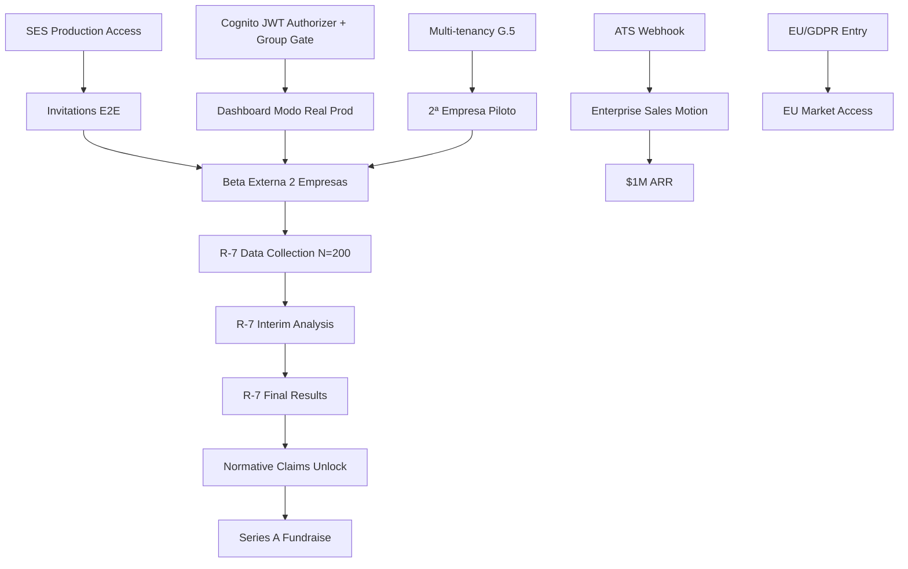

# KRUMM 18-Month Roadmap (Post-Investment)

**Versión:** 1.0
**Fecha:** 2026-09-15
**Fuente:** `docs/plans/2026-09-12-next-phase-comprehensive-plan.md` + `docs/investor/pitch-deck.md` (Slide 12) + AGENTS.md estado 2026-09-15
**Estado:** Compromisos (✓ Done / 🔄 In Progress / ○ Planned) e Hipótesis (★) separados explícitamente.

---

## Resumen Ejecutivo

| Horizonte | Foco Principal | Hito Clave | Métrica Norte |
|-----------|----------------|------------|---------------|
| **Q4 2026** (Oct–Dic) | Beta externa + validación científica | 2 pilotos firmados + R-7 protocol approved | 2 logos, R-7 OSF pre-reg |
| **Q1 2027** (Ene–Mar) | Integraciones enterprise + recolección datos | ATS Greenhouse/Lever + SSO/SCIM + R-7 N=200 start | 10 customers, $150k ARR |
| **Q2 2027** (Abr–Jun) | Producto extensible + expansión LATAM | Custom battery builder + API v1 + CO/MX launch | $400k ARR, R-7 interim |
| **Q3 2027** (Jul–Sep) | Escala global + Series A | Mobile PWA + EU/GDPR entry (DPO) + R-7 results | $1M ARR runway, normative claims |

> **Convención:** ✓ = completado/verificado 2026-09-15 | 🔄 = en ejecución | ○ = planificado | ★ = hipótesis (requiere validación)

---

## Q4 2026 — Foundation & Beta (Oct–Dic 2026)

### Producto

| # | Iniciativa | Estado | Detalle | Owner |
|---|------------|--------|---------|-------|
| P1 | **Beta externa 2 empresas** | 🔄 | Onboarding runbook `docs/beta/beta-onboarding-runbook.md` v1.0 listo. Firma contratos B2B (template `docs/legal/piloto-b2b-contrato-template.md`). 2–3 usuarios internos por empresa. | Carlos / Nicolás |
| P2 | **Multi-tenancy real (G.5)** | 🔄 | `companyId` obligatorio en invitations + sesiones. GSI `companyId-index` en sessions. Authorizer inyecta `tenant` desde Cognito `custom:companyId`. Tests aislamiento A/B PASS local. **Pendiente:** verificación 2 tenants Cognito reales (timeout endpoint). | Carlos |
| P3 | **ATS webhook (MVP)** | ○ | POST `/webhooks/ats` (Greenhouse/Lever) → evento `report_viewed` + `export_downloaded`. Auth: shared secret + HMAC. Retry exponencial + dead-letter queue. | Carlos |
| P4 | **Batería `stable_dg` inmutable** | ✓ | 5 juegos, ~14–16 min, default pública. No cambios sin validación comparativa. | Carlos |
| P5 | **Batería `original` controlada** | ✓ | 7 juegos (incluye BOMB + Control Room), ~18–23 min, `?battery=original`. FeatureVector v2.3.0 (60 features). | Carlos |

### Ciencia / Validación (R-7)

| # | Iniciativa | Estado | Detalle | Owner |
|---|------------|--------|---------|-------|
| S1 | **R-7 Protocol Design** | ○ | OSF pre-registration, ethics committee (Chile + internacional), N=200, power analysis (α=0.05, 1-β=0.80, efecto medio d=0.5). Convergent/discriminant validity + test-retest. Instrumentación: `src/telemetry/researchExport.js` (anonymized, structured). | Carlos + Psychometrician |
| S2 | **Academic Advisor LOI** | ★ | Target: PhD I/O Psych + publication record en talent assessment. Compromiso: revisión protocolo + co-autoría papers. | Carlos |
| S3 | **Ethics Committee Submission** | ○ | Comité ética USM / universidad extranjera. Incluye DPIA, consentimiento informado, data deletion <24h, compensación participantes. | Carlos |

### Comercial

| # | Iniciativa | Estado | Detalle | Owner |
|---|------------|--------|---------|-------|
| C1 | **2 Pilot Agreements Signed** | 🔄 | Template B2B + DPA anexo. Versión bilingüe ES/EN para 2ª empresa si extranjera. Gate: al menos 1 firmado antes de lanzar beta externa. | Nicolás |
| C2 | **Founder-Led Sales** | 🔄 | Direct outreach CH/CO/MX HR leaders, VC portfolio, LinkedIn. Target: 5 pilot logos → 3 paid conversions → $100k ARR. | Nicolás |
| C3 | **Content/SEO Foundation** | ○ | Blog posts: "Evidence-based hiring", "NYC LL144 compliance", "GDPR-safe assessments". Inbound pipeline. | Nicolás |

### Infra / Ops

| # | Iniciativa | Estado | Detalle | Owner |
|---|------------|--------|---------|-------|
| I1 | **Observabilidad CloudWatch (C.2)** | ○ | Dashboards: sesiones por battery, duración p50/p95 por juego, `privacy_validation_failures`, señal calidad agregada. Alarmas: privacy failure → Discord hermes-alerts, Lambda errors >5%/5min, API GW throttling. Logs JSON estructurados (`sessionId`, `battery`, `eventType`, `durationMs`, `privacyOk`). | Carlos |
| I2 | **Lighthouse CI Gate** | ✓ | Perf ≥90, a11y=100, BP=100, SEO≥90 en `/`, `/portal`, `/candidato`. Chrome 151 pinned. Quick wins: self-hosted Google Fonts (325 kB woff2), logo 49 kB WebP, preloads Archivo 900/600. Gate: 2 passes con backoff 90s. | Carlos |
| I3 | **Sentry Cloud Free** | ✓ | Frontend `@sentry/react` + `ErrorBoundary` marca. Backend `@sentry/node` solo 500s (tags code+route, sin payloads). CSP m7 deployed. DSN via GH secret. **Acción usuario:** Sentry UI → IP Addresses: "Do Not Store". | Carlos |
| I4 | **WAF CloudFront + Rate Limit** | ✓ | `krumm-cf-waf` (CRS+KnownBadInputs, Override None) asociado stage+prod vía ARN. Rate limit 10 req/min/IP en Lambda + tabla `krumm-staging-rate-limit` (TTL 3 min). ZAP baseline 0 critical/high. | Carlos |
| I5 | **Backup/DR (G.4)** | ✓ | DynamoDB PITR 35d ENABLED (sessions/invitations/audit-log). S3 Versioning Enabled. Restore exercise PASS: 11/11 items, RTO 223s < 1h. Runbook `docs/ops/dr-backup.md`. | Carlos |
| I6 | **FinOps Monthly** | ✓ | `scripts/cost-projection.sh` + `docs/ops/finops.md`. Staging ≈$0.034/mes, $0.00078/eval. Budget $25/mes → forecast $0.27. Alarmas 80/100% en consola. | Carlos |

### Legal / Compliance

| # | Iniciativa | Estado | Detalle | Owner |
|---|------------|--------|---------|-------|
| L1 | **Privacy Policy + Terms of Service** | ✓ | `docs/legal/politica-privacidad.md`, `docs/legal/terminos-de-servicio.md`. Rutas `/legal/terminos`, `/legal/privacidad` en footer V3. | Carlos |
| L2 | **DPIA + DPA Template** | ✓ | `docs/security/dpia.md` (resumen), DPA anexo en contrato piloto. SCC 2021/914 con AWS referenciado. | Carlos |
| L3 | **Cookie Notice + Consent** | ✓ | Banner implementado, cookie `cookie_consent` (1 año). PostHog opt-in only. | Carlos |
| L4 | **Data Deletion Runbook** | ✓ | `scripts/data-deletion-request.sh` (<24h). `docs/ops/data-deletion-request.md`. | Carlos |

---

## Q1 2027 — Integrations & Data Collection (Ene–Mar 2027)

### Producto

| # | Iniciativa | Estado | Detalle | Owner |
|---|------------|--------|---------|-------|
| P6 | **ATS Integrations: Greenhouse + Lever** | ○ | OAuth / API key per tenant. Sync: candidate profile → invitation → session → report → export → write-back `candidate.custom_fields.krumm_report_url`. Webhook `report_viewed` + `export_downloaded`. | Carlos (eng hire) |
| P7 | **SSO/SCIM (SAML 2.0 + SCIM 2.0)** | ○ | Okta, Azure AD, Google Workspace. Provisioning automático recruiters → Cognito groups `recruiters`/`admins`. `custom:companyId` mapping. | Carlos (eng hire) |
| P8 | **Custom Battery Builder (Admin UI)** | ○ | `/empresa/diseno/bateria` — drag-drop juegos, ajustar trials/duración, preview fixture. Validación: energía total ≤ budget, construct coverage ≥1 per domain. Export blueprint JSON. | Carlos (eng hire) |
| P9 | **API v1 (Public)** | ○ | `GET /v1/sessions`, `POST /v1/invitations`, `GET /v1/reports/:id`, `POST /v1/webhooks`. Auth: API key per tenant (rotatable). Rate limit 100 req/min. OpenAPI spec + Postman collection. | Carlos (eng hire) |
| P10 | **Team Reports (Aggregate)** | ○ | Agregado por proceso/equipo: distribución constructos, quality flags, completion rates. `descriptive_only`, `humanReviewOnly`. No ranking individual. | Carlos |

### Ciencia / Validación (R-7)

| # | Iniciativa | Estado | Detalle | Owner |
|---|------------|--------|---------|-------|
| S4 | **R-7 Data Collection Start (N=200)** | ○ | Reclutamiento: 200 participantes (Chile + remoto LATAM). Incentivos: $50 USD c/u = $10k total. Protocolo: consentimiento → demographic survey → KRUMM battery `original` (7 juegos) → post-session survey (NASA-TLX, SUS, engagement) → 2-week test-retest (N=50 subset). | Carlos + Psychometrician |
| S5 | **Interim Analysis Plan** | ○ | Pre-registered: convergent validity vs. cognitive tests (WAIS-IV subsets), discriminant vs. personality (BFI-2), test-retest ICC. Análisis ciego. | Psychometrician |

### Comercial

| # | Iniciativa | Estado | Detalle | Owner |
|---|------------|--------|---------|-------|
| C4 | **10 Customers / $150k ARR** | ○ | Conversión pilotos → pagados. Subscription $2,500/yr (unlimited evals, 5 seats, API). Per-eval $150 para SMB. Pipeline: 30 qualified → 10 closed. | Nicolás |
| C5 | **Partner Channel Initiation** | ○ | HR consultancies, executive search firms. Revenue share 20% año 1. Target: 3 partners firmados. | Nicolás |

### Infra / Ops

| # | Iniciativa | Estado | Detalle | Owner |
|---|------------|--------|---------|-------|
| I7 | **Cost Optimization** | ○ | Revisión mensual FinOps. Target: COGS/eval <$0.001 a escala. Lambda provisioned concurrency si cold starts >200ms p95. | Carlos |
| I8 | **Security Review (External)** | ○ | Pentest anual (tercero). Revisión código critica paths (auth, payments, data export). | Carlos (budget legal/compliance) |

---

## Q2 2027 — Extensibility & LATAM Expansion (Abr–Jun 2027)

### Producto

| # | Iniciativa | Estado | Detalle | Owner |
|---|------------|--------|---------|-------|
| P11 | **Custom Battery Builder v2 (Candidate-Facing)** | ○ | Candidato ve batería personalizada por empresa. Branding por tenant (logo, colores `--k-*` override). | Carlos (eng hire) |
| P12 | **Advanced Analytics Dashboard** | ○ | Cohort analysis, funnel drop-off por juego, quality trends, benchmark anonimizado cross-tenant (opt-in). | Carlos (ML hire) |
| P13 | **Mobile PWA (Progressive Web App)** | ○ | Service Worker + Web App Manifest. Offline: cache shell + fixture. Install prompt. Push notifications (recordatorio invitación, reporte listo). iOS Safari + Android Chrome. | Carlos (eng hire) |
| P14 | **Battery `original_extended` (Decision Gate)** | ★ | Si `original` 7 juegos >30 min fatiga → evaluar `original_extended` (9–10 juegos) vs. acortar `original`. Decisión en C6 (plan original). | Carlos + Psychometrician |

### Ciencia / Validación (R-7)

| # | Iniciativa | Estado | Detalle | Owner |
|---|------------|--------|---------|-------|
| S6 | **R-7 Interim Analysis** | ○ | N=100 completados. Validación convergente/discriminante preliminar. Ajuste protocolo si power insuficiente. | Psychometrician |
| S7 | **Normative Sample Design** | ★ | Si R-7 interino positivo: diseñar muestra normativa N=500+ (stratified by age, education, role) para baremos poblacionales. | Psychometrician |

### Comercial

| # | Iniciativa | Estado | Detalle | Owner |
|---|------------|--------|---------|-------|
| C6 | **LATAM Expansion: Colombia + Mexico** | ○ | Entidad legal CO/MX o Employer of Record. Localización ES-CO/ES-MX (v3Copy.js + legal docs). Partner local por país. Target: 5 customers CO + 5 MX. | Nicolás |
| C7 | **$400k ARR** | ○ | 50 customers × $2,500 + per-eval upsell. Pipeline 100 qualified. | Nicolás |

### Infra / Ops

| # | Iniciativa | Estado | Detalle | Owner |
|---|------------|--------|---------|-------|
| I9 | **Multi-Region AWS (SA-East-1 + US-East-1)** | ○ | Latencia <100ms LATAM. DynamoDB Global Tables para sessions/invitations. CloudFront + S3 CRR. | Carlos (DevOps hire) |
| I10 | **SOC 2 Type I Readiness** | ○ | Políticas, controles, evidencia. Auditor externo Q3. | Carlos (legal/compliance budget) |

---

## Q3 2027 — Global Scale & Series A (Jul–Sep 2027)

### Producto

| # | Iniciativa | Estado | Detalle | Owner |
|---|------------|--------|---------|-------|
| P15 | **EU/GDPR Entry** | ○ | DPO EU (contrato). SCC 2021/914 + UK Addendum. Hosting EU (Frankfurt/París). DPIA actualizado. Data residency option per tenant. | Carlos + Legal Counsel |
| P16 | **Mobile PWA Launch** | ○ | App Store / Play Store (TWA / Capacitor). Biometric opt-in nativo (FaceID/TouchID para auth, NO para telemetría). | Carlos (eng hire) |
| P17 | **R-7 Results → Normative Claims** | ★ | Si R-7 exitoso: desbloquear claims "percentil poblacional", "baremo por rol", "cutoffs validados". Mantener `humanReviewOnly` pero con evidencia normativa. | Carlos + Psychometrician |
| P18 | **Series A Prep** | ○ | Data room v2 (tracción, R-7 results, team, financials). Target: $5–10M Series A, $15–25M pre-money. | Carlos / Nicolás |

### Ciencia / Validación

| # | Iniciativa | Estado | Detalle | Owner |
|---|------------|--------|---------|-------|
| S8 | **R-7 Final Analysis + Publication** | ★ | Paper submit: "Gamified Work-Sample Battery for Talent Assessment: Validity & Fairness Evidence". Target: Journal of Applied Psychology / Personnel Psychology. Open data OSF. | Psychometrician + Carlos |
| S9 | **Construct Expansion Research** | ★ | Diseño R-8: Leadership (multi-agent), Communication (async), Adaptability (transfer learning). Grant application (CORFO/ANID Chile, EU Horizon). | Carlos + Advisor |

### Comercial

| # | Iniciativa | Estado | Detalle | Owner |
|---|------------|--------|---------|-------|
| C8 | **$1M ARR Runway** | ○ | 200 customers × $2,500 + enterprise deals. Sales team: 2 AE + 1 SDR. | Nicolás |
| C9 | **Enterprise Direct Motion** | ○ | Dedicated sales, custom batteries, SSO/SCIM, SLA 99.9%, dedicated tenant. Target: 3 enterprise logos >5000 emp. | Nicolás |

### Infra / Ops

| # | Iniciativa | Estado | Detalle | Owner |
|---|------------|--------|---------|-------|
| I11 | **SOC 2 Type II** | ○ | Año 1 completo. Evidencia continua. | Carlos (DevOps hire) |
| I12 | **Disaster Recovery Multi-Region** | ○ | RPO <5 min, RTO <30 min. Cross-region failover automatizado. | Carlos (DevOps hire) |
| I13 | **Team Scaling** | ○ | Hires: Senior Fullstack, ML Engineer, DevOps/SRE, Sales AE×2, SDR, Customer Success. Total ~8–10 FTE. | Carlos / Nicolás |

---

## Dependencias Críticas (Critical Path)

**Riesgo mayor en critical path:** R-7 recruitment timeline (N=200 en 6 meses = ~8/semana). Mitigación: incentivos $50, canales universitarios + LinkedIn, remote-first.

---

## Gates de Calidad por Trimestre

| Trimestre | Gates Obligatorios | Métricas de Salida |
|-----------|-------------------|-------------------|
| **Q4 2026** | 2 pilotos firmados, beta onboarding PASS, multi-tenancy staging verified, Lighthouse CI verde, Sentry live, WAF/ZAP clean, DR exercise PASS, FinOps baseline | 2 logos, R-7 protocol OSF pre-reg, infra cost <$0.05/eval |
| **Q1 2027** | Greenhouse/Lever webhook live, SSO/SCIM staging, API v1 docs, R-7 N=200 recruiting ≥50% | 10 customers, $150k ARR, R-7 N=100 collected |
| **Q2 2027** | Mobile PWA installable, Custom Battery Builder admin, LATAM entities ready, SOC 2 Type I ready | $400k ARR, R-7 interim positive, 5 CO + 5 MX pipeline |
| **Q3 2027** | EU DPO + hosting, PWA stores, R-7 final + paper submitted, SOC 2 Type II, Series A data room v2 | $1M ARR runway, normative claims ready, 3 enterprise logos |

---

## Hipótesis Explícitas (★) — Requieren Validación

| # | Hipótesis | Cómo Validar | Timeline | Decisión Si Falsa |
|---|-----------|--------------|----------|-------------------|
| ★1 | **R-7 convergent validity ≥0.4 vs WAIS-IV** | N=200, correlación processingSpeed vs. Digit Symbol, visuomotorPrecision vs. Block Design | Q1 2027 interim | Rediseñar constructos / reducir claims |
| ★2 | **Candidate completion rate >80% (7 juegos, 23 min)** | Beta tracking: `game_N_completed` funnel en PostHog | Q4 2026 | Acortar `original` a 5 juegos / crear `original_extended` |
| ★3 | **Recruiter NPS ≥40** | NPS 1-10 post-reporte (evento `nps_submitted` implementado F.2) | Q1 2027 | UX overhaul report / dashboard |
| ★4 | **COGS/eval < $0.001 at 10k evals/mes** | FinOps projection + real AWS billing | Q2 2027 | Optimizar Lambda / DynamoDB / negociar enterprise discount |
| ★5 | **2 pilot conversions to paid within 60 days** | CRM pipeline tracking (Linear/Nocion) | Q1 2027 | Revisar pricing / onboarding / product-market fit |
| ★6 | **Mobile PWA adoption >30% of sessions** | PostHog: `pwa_installed` + session source | Q3 2027 | Priorizar native app / mejorar PWA |
| ★7 | **EU entry enables 20% revenue uplift** | Market sizing + pilot demand EU | Q3 2027 | Postergar EU / focus LATAM + US Hispanic |
| ★8 | **Custom battery builder drives enterprise upsell** | % enterprise customers using custom battery | Q2 2027 | Simplificar a presets / plantillas |

---

## Presupuesto 18 Meses (USD) — Cash-Out Neto (Founder Absorbed)

| Categoría | Q4'26 | Q1'27 | Q2'27 | Q3'27 | Total | Notas |
|-----------|-------|-------|-------|-------|-------|-------|
| **Engineering (hires)** | $0 | $75k | $150k | $225k | **$450k** | 3 FTE: fullstack, ML, DevOps (market 50th %ile + equity) |
| **Science / Validation (R-7)** | $20k | $80k | $60k | $40k | **$200k** | Participantes $10k, psychometrician $50k, ethics $10k, stats consulting $30k, publication $20k, normative design $80k |
| **Sales / Marketing** | $30k | $50k | $60k | $60k | **$200k** | Founder time absorbed; AE hire Q2 ($120k), content $20k, events $30k, partner program $30k |
| **Legal / Compliance** | $15k | $25k | $30k | $30k | **$100k** | DPO EU $40k, contracts $20k, IP $15k, SOC 2 $25k, insurance $20k |
| **Ops / Infra / Buffer** | $5k | $10k | $15k | $20k | **$50k** | AWS overage, tools, contingency, GPU Lambda ($8.38/h × ~200h = $1.7k) |
| **TOTAL CASH-OUT** | **$70k** | **$240k** | **$315k** | **$375k** | **$1,000k** | **Runway 18 meses a $1M** |
| **Internal Opportunity Cost** | $45k | $90k | $135k | $180k | **$450k** | Founder + co-founder time (no cash) |
| **IVA Non-Recoverable (19% Chile)** | $13.3k | $45.6k | $59.9k | $71.3k | **$190k** | Servicios profesionales, AWS (parcial), tools |
| **ECONOMIC TOTAL** | **$128.3k** | **$375.6k** | **$509.9k** | **$626.3k** | **$1,640k** | Para planning interno |

> **Nota:** Cash-out neto asume founder sin sueldo hasta Series A. IVA calculado sobre cash-out services (no AWS credit-eligible). Ajustar por dólar observado / UF al momento de ejecución.

---

## Equipo Objetivo (18 Meses)

| Rol | Trimestre | Perfil | Fuente |
|-----|-----------|--------|--------|
| Senior Fullstack (React/Node/AWS) | Q1'27 | 5+ años, TypeScript, serverless, testing | LinkedIn / referidos / VC portfolio |
| ML Engineer (feature vector, validation) | Q1'27 | PhD/MS ML, psychometrics exposure, Python/ONNX/TFJS | Academic network / conferences |
| DevOps/SRE (AWS, observability) | Q2'27 | 5+ años, CDK/SAM, CloudWatch, CI/CD, security | AWS community / referidos |
| Account Executive ×2 | Q2'27 | 3+ años B2B SaaS HR/Tech, LATAM network | LinkedIn / sales recruiters |
| SDR | Q2'27 | 1–2 años, outbound, Spanish/English fluent | Junior hire + training |
| Customer Success | Q3'27 | 3+ años, onboarding, retention, expansion | CS community |
| DPO EU (contractor) | Q3'27 | CIPP/E, GDPR, Chile Ley 19.628, cross-border | Legal network |

---

## Riesgos y Mitigaciones (Actualizado 2026-09-15)

| Riesgo | Probabilidad | Impacto | Mitigación | Owner |
|--------|--------------|---------|------------|-------|
| SES sandbox no sale / bounce rate alto | Baja | Bloquea invitaciones reales | Invitaciones manuales email propio durante beta; monitoring bounce/complaint <1% | Carlos |
| Cognito auth complexities (MFA, groups) | Media | Retrasa dashboard modo real | Amplify v6 abstrae flujos; fallback demo siempre funcional; tests 24/24 | Carlos |
| Juegos revelan bugs sincronización tardíos | Alta | Re-trabajo Fase B | T.2 done (local-signal-sync-audit.md); auditoría B.1 sistemática; fixture genuinas | Carlos |
| Duración `original` 7 juegos >30 min fatiga | Media | Decisión producto C6 | Medir en beta (PostHog `duration_s`); opción `original_extended` | Carlos + Psychometrician |
| Claims HR no soportados en texto | Baja | Legal/reputación | Barrido automático (script) + revisión manual pre-lanzamiento; `humanReviewOnly` visible | Carlos |
| GPU Lambda costos inesperados | Baja | Presupuesto | Budget $25/mes + alarmas 80/100%; GPU solo heavy tasks; auto-off >1h idle | Carlos |
| Key Lambda leakada en git history | **Cierta** | Seguridad | **Solo-usuario: invalidar en dashboard AWS** (pendiente desde 2026-09-10) | Usuario |
| R-7 recruitment N=200 en 6 meses | Media | Ciencia / Series A | Incentivos $50, canales univ. + LinkedIn, remote-first, test-retest subset N=50 | Carlos + Psychometrician |
| Competitor response (Pymetrics/Arctic Shores pivot) | Media | Mercado | Moat: transparency + compliance + privacy + versioned feature vector; speed to pilots | Nicolás |
| Regulatory change (NYC LL144 enforcement, EU AI Act) | Baja | Compliance | DPIA done, `humanReviewOnly` baked, legal counsel retained, monitoring | Carlos + Legal |

---

## Métricas Norte (North Star Metrics)

| Métrica | Q4'26 Target | Q1'27 Target | Q2'27 Target | Q3'27 Target |
|---------|--------------|--------------|--------------|--------------|
| **Pilots Signed** | 2 | 3 (paid) | 8 | 15 |
| **ARR** | $0 | $150k | $400k | $1M |
| **R-7 Progress** | Protocol OSF pre-reg | N=100 collected | Interim analysis + | Final + paper submitted |
| **Completion Rate (7 juegos)** | >70% (beta) | >80% | >85% | >85% |
| **Recruiter NPS** | N/A (beta) | ≥40 | ≥50 | ≥50 |
| **COGS/eval** | $0.00078 | $0.0007 | $0.0005 | $0.0004 |
| **Lighthouse Perf** | ≥90 | ≥90 | ≥92 | ≥95 |
| **Privacy Validation Failures** | 0 | 0 | 0 | 0 |
| **Multi-tenant Isolation** | 2 verified | 10 verified | 50 verified | 200 verified |

---

## Sincronización y Gobernanza

- **Kanban + Linear:** Cada task completada → actualizar card (status, comentario con evidencia) + transición Linear issue (Done/In Progress). AGENTS.md actualizado en cada cierre.
- **Commits:** Solo con instrucción explícita del usuario. `git commit -m "type: description"`.
- **Discord Notificación:** DM `.sarlock` al cerrar fase completa (webhook `DISCORD_ALERTS_WEBHOOK_URL` para infra, `DISCORD_OPS_WEBHOOK_URL` para orquestador).
- **Revisiones:** Semanal (lunes 09:00 CL) — revisar roadmap, blockers, métricas, kanban/Linear sync.
- **Versionado Roadmap:** `roadmap-18m.md` v1.0 → v1.1 tras cada trimestre completado (commit + tag `roadmap-qX-202X`).

---

## Apéndice: Referencias Cruzadas

| Documento | Ubicación | Uso en Roadmap |
|-----------|-----------|----------------|
| Plan Maestro Completo | `docs/plans/2026-09-12-next-phase-comprehensive-plan.md` | Fases A–H, gates, estimaciones, riesgos |
| Pitch Deck v1.1 | `docs/investor/pitch-deck.md` | Slides 12 (roadmap), 13 (use of funds), 8 (unit economics) |
| Data Room Checklist | `docs/investor/data-room-checklist.md` | Items 3.1, 3.3, 4.1–4.12, 7.1–7.6 |
| Beta Onboarding Runbook | `docs/beta/beta-onboarding-runbook.md` | P1, C1 |
| Beta Protocol | `docs/beta/beta-protocol.md` | P1, S1 |
| FinOps | `docs/ops/finops.md` + `scripts/cost-projection.sh` | I6, unit economics |
| DR/Backup | `docs/ops/dr-backup.md` | I5 |
| Environments | `docs/ops/environments.md` | I1, I9 |
| Privacy/Data Flow | `docs/security/privacy-data-flow.md` | L1–L4, compliance |
| Security (CSP, WAF, ZAP) | `SECURITY.md` + `docs/security/` | I3, I4 |
| Game Specs | `docs/spec/EXP-BOMB-001/`, `docs/spec/EXP-COMM-001/` | P4, P5 |
| Feature Vector | `src/telemetry/assessmentFeatureVector.js` | P4, P5, S1 |
| Research Export | `src/telemetry/researchExport.js` | S1, S4 |
| PostHog Metrics | `docs/ops/metrics.md` | S4, North Star |

---

**Versión:** 1.0 (2026-09-15)
**Autor:** Hermes Agent (kanban task `t_26fb484a` — H3 ejecución)
**Próxima revisión:** 2026-10-01 (Q4 2026 kickoff) — actualizar estado ✓/🔄/○, validar ★ hipótesis con datos beta.