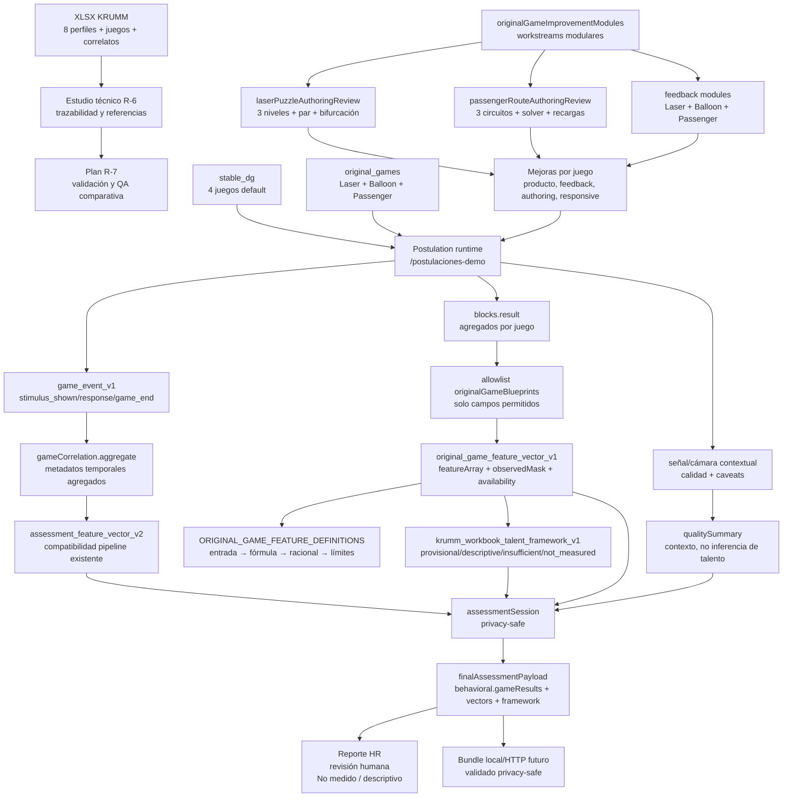

# KRUMM Current State — Plan Review, I/O Graph and Risk Notes

**Fecha:** 2026-07-20  
**Ruta producto:** `/postulaciones-demo`  
**Default:** `stable_dg`  
**Modo interno:** `?battery=original`  
**Fuente XLSX:** `Mapeo de Perfiles de Talento e Indicadores de Comportamiento - KRUMM.xlsx`

---

## 1. Qué existe hoy

### Producto y baterías

- `stable_dg`: batería default/fallback con 4 juegos DG.
- `original_games`: batería interna controlada con 3 juegos originales:
  - `laser_puzzle`
  - `balloon_risk`
  - `passenger_routes`
- Fixtures disponibles:
  - `/postulaciones-demo?fixture=1`
  - `/postulaciones-demo?fixture=1&battery=original`

### Documentación

- Plan maestro: `docs/plans/postulation-demo-original-games-integration-plan.md`.
- Handoff vigente: `docs/plans/postulation-demo-original-games-new-agent-handoff.md`.
- Estudio técnico R-6: `docs/research/krumm-talent-game-behavior-mapping-technical-study.md`.
- Plan R-7: `docs/plans/2026-07-20-r7-validation-and-metric-justification-plan.md`.
- Contexto durable para agentes: `AGENTS.md`.

### Artefactos técnicos R-6

- `src/assessment/originalGameFeatureVector.js`
  - `original_game_feature_vector_v1`
  - `ORIGINAL_GAME_FEATURE_DEFINITIONS`: diccionario input agregado → fórmula → racional → constructo → límites.
- `src/assessment/originalGameTalentMapping.js`
  - `krumm_workbook_talent_framework_v1`
  - Constructos del Excel con disponibilidad explícita.
- `src/tasks/original-games/originalGameImprovementModules.js`
  - módulos separados para mejorar juegos sin mezclar UI, telemetría, validación y explicación.
- `src/tasks/original-games/laserPuzzleFeedback.js`, `balloonRiskFeedback.js`, `passengerRouteFeedback.js`
  - feedback explicativo aggregate-only para los tres juegos originales, visible en el reporte.
- `src/tasks/original-games/passengerRouteAuthoringReview.js`
  - revisión modular de solvencia, presupuesto, paradas y layout compacto para Passenger sin exportar geometría autorada ni rutas de candidato.
- `src/tasks/original-games/laserPuzzleAuthoringReview.js`
  - revisión modular de solvencia autorada, par esperado, bifurcación y layout compacto para Laser sin exportar beam cells ni grillas.
- `docs/plans/2026-07-20-laser-passenger-product-game-design-review.md`
  - revisión producto-final por juego: progresión, narrativa, dificultad, métricas permitidas y límites.
- `exports/krumm-r6-r7-current-flow.pdf`
  - gráfico PDF de estado actual y flujo R-6/R-7 para presentación.

---

## 2. En qué se está trabajando

1. **R-7 QA/validación comparativa.** Ya existe el plan, falta ejecutarlo con participantes/datos y revisión experta.
2. **Trazabilidad métrica.** Ya se implementó en código, pero debe revisarse con expertos y datos reales.
3. **Modularización de mejoras de juegos.** Ya existe un catálogo inicial de módulos; `laser.failure-explanation`, `laser.level-authoring-review`, `balloon.feedback-comprehension`, `passenger.constraint-feedback` y `passenger.route-authoring-review` tienen núcleo puro implementado.
4. **Revisión producto-final de Laser y Passenger.** Ambos juegos tienen 3 niveles/circuitos con objetivo, reto, dificultad progresiva y tests de solvencia/layout; falta calibración con usuarios reales.

---

## 3. Qué falta por hacer

### Técnico inmediato

- Smoke browser específico del reporte original ejecutado: feedback visible para Laser, Balloon y Passenger en desktop y móvil, sin overflow ni errores.
- Implementar después módulos de authoring/dificultad restantes:
  1. `balloon.threshold-calibration-review`
  2. `shared.candidate-instruction-check`
  3. `shared.mobile-accessibility-qa`
- Añadir smoke específico de copy/feedback cuando el módulo sea visible.

### Validación R-7

- Ejecutar QA comparativa stable/original con cámara permitida/denegada.
- Revisar contenido con expertos I-O/psicometría.
- Hacer entrevistas cognitivas para detectar errores de comprensión.
- Estimar confiabilidad y formas paralelas.
- Validar convergente/discriminante contra instrumentos establecidos.
- Validar criterio laboral, si existiera criterio definido previamente.
- Analizar fairness/device effects.
- Decidir si mantener DG, usar original, usar mixta o iterar.

---

## 4. Gráfico de entradas, procesos y salidas actuales



---

## 5. Estado de constructos del Excel

| Constructo | Estado actual | Fuente R-6 | Qué falta |
|---|---|---|---|
| Toma de decisiones | `descriptive_only` | Balloon/Passenger descriptivo | criterio externo para dirección normativa |
| Resolución de problemas | `provisional_score` | Laser + Passenger completos | validez de contenido, convergente y confiabilidad |
| Riesgo/feedback | `descriptive_only` | Balloon | no inferir personalidad/frustración; validar contra BART solo si se decide |
| Planificación | `provisional_score` | Passenger | validación de solver/niveles y convergencia |
| Adaptabilidad | `insufficient` | no suficiente | tareas con cambios de regla/control experimental |
| Pensamiento analítico | `provisional_score` | Laser + Passenger | evidencias externas y límites del constructo |
| Liderazgo | `not_measured` | ninguna tarea actual | tarea social/rol/grupal validada |
| Comunicación | `not_measured` | ninguna tarea actual | tarea comunicativa/feedback textual validada |

---

## 6. Mejoras / fuentes de error detectadas

### 6.1 Métricas y validación

- `laser.solutionEfficiency` depende de que el par de cada nivel sea justo. Si el par está mal calibrado, la métrica castiga o premia incorrectamente.
- `balloon.riskEfficiency` puede confundirse con personalidad o tolerancia a la frustración. Debe permanecer descriptivo.
- `balloon.postLossAdjustment` necesita suficientes oportunidades post-pérdida; con pocas pérdidas el dato es frágil.
- `passenger.constraintCompliance` mejora al usar `movementAttemptCount`; sin denominador, las violaciones absolutas serían injustas.
- `passenger.routeEfficiency` depende de solver y authoring; si un nivel tiene solución mínima mal estimada, el score pierde sentido.

### 6.2 UX / explicación

- Errores de Passenger pueden ser difíciles de explicar si el candidato no entiende costo horizontal/vertical, presupuesto o paradas.
- Balloon necesita copy claro: explotar el globo no debe presentarse como “fallo personal”, sino como evento de feedback de riesgo.
- Laser necesita feedback de resolución sin revelar solución ni ruta del haz.
- Los constructos `descriptive_only` y `not_measured` deben ser visibles y entendibles; si se ocultan, el reporte puede parecer más definitivo de lo que es.

### 6.3 Privacidad

- Cualquier nuevo módulo de feedback debe recibir solo agregados. Nunca debe pedir rutas, celdas visitadas, pump sequence, beam cells, pointer samples o raw events.
- Los módulos de QA responsive pueden usar viewport/overflow, pero eso es QA técnico, no evaluación del candidato.

### 6.4 Arquitectura

- Riesgo: mezclar mejoras de juegos dentro de componentes React grandes. Solución: módulos puros por juego con tests antes de UI.
- Riesgo: añadir copy interpretativo en UI sin reflejarlo en reportes/JSON. Solución: source of truth modular con outputs estructurados.
- Riesgo: expandir el framework R-6 hasta parecer validado. Solución: mantener `status: provisional`, nulls y caveats hasta R-7.

---

## 7. Módulos separados creados para mejorar juegos

Archivo:

```text
src/tasks/original-games/originalGameImprovementModules.js
```

Módulos iniciales:

| Módulo | Juego(s) | Estado | Propósito |
|---|---|---|---|
| `laser.failure-explanation` | Laser | `implemented_core` | explicar fallos sin beamCells ni movimientos crudos |
| `laser.level-authoring-review` | Laser | `implemented_core` | revisar par, dificultad, bifurcación y solvencia autorada |
| `balloon.feedback-comprehension` | Balloon | `implemented_core` | explicar cashout/loss/post-loss sin secuencias |
| `balloon.threshold-calibration-review` | Balloon | `planned` | revisar distribución de pérdidas y dificultad |
| `passenger.constraint-feedback` | Passenger | `implemented_core` | explicar presupuesto, bloqueos, paradas y restricciones |
| `passenger.route-authoring-review` | Passenger | `implemented_core` | revisar solver, presupuesto y dificultad |
| `shared.candidate-instruction-check` | todos | `planned` | separar comprensión de instrucciones de desempeño |
| `shared.mobile-accessibility-qa` | todos | `planned` | QA responsive/accesibilidad modular |

Los tres módulos de feedback base ya están conectados al reporte visible. `laser.level-authoring-review` y `passenger.route-authoring-review` aparecen en el drawer técnico del reporte original como QA de authoring, separados de la explicación al candidato.

### 7.1 Verificación de feedback visible

```text
Comando: BASE_URL=http://127.0.0.1:5177 node scripts/smoke-postulation-feedback.mjs
Viewports: 1280×720 y 390×844
Rutas: stable/original + fixtures
Resultado: 8/8 PASS
Console errors: 0
Page errors: 0
Request failures: 0
Overflow horizontal: 0
Feedback fixture original: Solución clara + Estrategia riesgo/recompensa + Ruta eficiente + No medido + Authoring Laser/Passenger visible
Forbidden visible en reportes fixture: 0
Suite completa posterior: 88 files / 365 tests PASS
Build: PASS; audit high prod: 0 vulnerabilidades; oxlint: 0 warnings / 0 errors; git diff --check: OK
```

---

## 8. Siguiente recomendación

Siguiente paso: `balloon.threshold-calibration-review` y `shared.candidate-instruction-check`, para revisar dificultad/thresholds y comprensión sin mezclar authoring con desempeño del candidato. Núcleos puros actuales:

```text
src/tasks/original-games/laserPuzzleFeedback.js
src/tasks/original-games/laserPuzzleFeedback.test.js
src/tasks/original-games/laserPuzzleAuthoringReview.js
src/tasks/original-games/laserPuzzleAuthoringReview.test.js
src/tasks/original-games/balloonRiskFeedback.js
src/tasks/original-games/balloonRiskFeedback.test.js
src/tasks/original-games/passengerRouteFeedback.js
src/tasks/original-games/passengerRouteFeedback.test.js
src/tasks/original-games/passengerRouteAuthoringReview.js
src/tasks/original-games/passengerRouteAuthoringReview.test.js
```

```text
entradas: passengersDelivered, destinationCount, routeEfficiency, movementAttemptCount,
          replanCount, stationUseCount, constraintViolationCount, satisfactionScore
salidas: constraintFeedbackCategory, candidateHint, reviewerCaveat, nextDesignProbe
```

Criterio: explicar sin guardar rutas ni intentos crudos.
